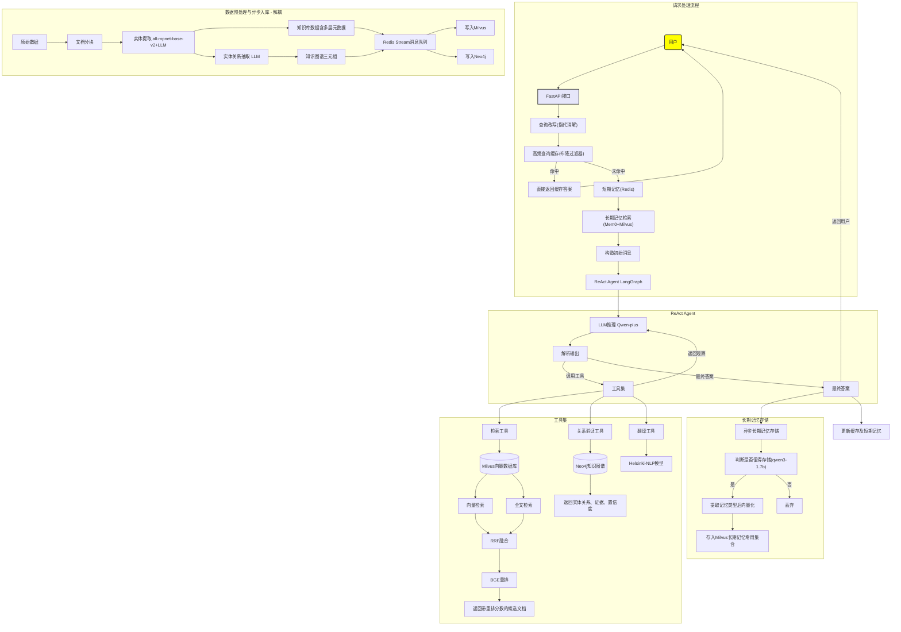

## 🖼️ 流程图

## 📖 项目简介

**Rag** + **ReAct Agent** 开发的**生产级多轮对话系统**，能够根据对话历史与当前问题，**自主规划思考并循环调用多个工具集**，包括混合检索+重排、实体关系验证、翻译等工具，最终生成可信答案。通过**多级记忆（短期+长期）与查询改写(指代消解)**，系统在多轮对话中保持上下文连贯，并能持久化存储用户画像，实现复杂问题的精准回答。除此之外系统支持**中英双语交互**，支持中文问-英文检-中文回复的完整链路，设计前提是因为知识库为英文数据集，**保证同语言检索精度无损**。

## ✨ 核心亮点

### 1、多轮对话与指代消解
- **短期记忆**：Redis Hash + Sorted Set 存储最近 5 轮对话，提供会话上下文。
- **长期记忆**：Mem0 + Milvus 实现用户画像持久化，支持**类型化记忆**（偏好/事实/事件）与**重要性排序**，可通过记忆类型和重要性排序进行检索与查询。
- **查询改写**：本地 Qwen3-4B 模型结合历史与记忆进行**指代消解**，将中文问题改写为独立英文检索问题，同时输出中文翻译。
- 选型理由：测试后 4B 模型在指代消解任务中达到精度与推理速度平衡且满足实时对话系统，qwen3-1.7b指代消解能力不佳，8b模型推理速度过慢。

### 2、ReAct Agent 自主规划与工具调用
- **Agent 核心**：Qwen-plus 模型（API）驱动 ReAct 循环，自主决定是思考、观察、行动(调用工具或生成答案)，设置最大循环上限5轮避免无限循环。
- 选型理由：当前用Qwen-plus API替代。后期本地有计算资源，部署qwen3-30b-a3b，3b激活参数MOE架构模型专用于ReAct Agent，具备自主规划循环调用各工具集能力。
- **工具集**：
  - **检索工具**：向量检索（IVF_RABITQ）+ BM25 全文检索 + RRF 融合 + BGE-reranker-v2 模型重排，最终生成包含重排模型评分的Top_5候选文档
  - 选型理由：BGE-reranker-v2 为 Hugging Face 开源成熟的专用重排模型，重排质量高且自带重排评分。
  - **实体关系验证工具**：基于 Neo4j 知识图谱验证实体间关系，输出结构化输出（包含实体关系、证据原文、置信度）。
  - **翻译工具**：Helsinki-NLP/opus-mt-en-zh 英转中模型将英文检索答案翻译为中文。
  - 选型理由：Hugging Face 开源成熟的英转中翻译专用模型，在WMT等基准上表现优异，翻译工作小size模型依然胜任工作且持有高推理速度。

### 3、检索系统深度优化
- **向量索引**：Milvus 2.6+ 版本新索引 **IVF_RABITQ** ，相较于HNSW等原主流索引内存占用极低（最高32倍压缩），且查询性能与召回精度皆超越其他索引。
- **全文检索**：Milvus 2.6+ 版本新功能，通过 `sparse` 字段 + BM25 Function 实现原生全文检索，无需额外引入Elasticsearch，增加数据库维护成本。
- **长期记忆存储**：Milvus 集合与知识库集合逻辑隔离，每条记忆包含记忆类型与重要性标签，支持时效性衰减混合排序。

### 4、数据预处理与知识图谱增强
- **实体提取**：本地模型 all-mpnet-base-v2 提取4种基础实体，LLM 抽取 11 种适配数据集的领域实体类型，作为元数据赋予知识库。
- **实体关系抽取**： LLM抽取实体关系，生成知识图谱三元组，存入图数据库Neo4j，后续支撑实体关系验证工具集。
- **模型量化**：all-mpnet-base-v2 经 ONNXRUNTIME 动态量化，体积 **缩小 4 倍**，推理速度提升 30%，精度损失<1%。
- **消息队列**：Redis Stream 解耦，知识库数据和知识图谱数据多消费者并行写入 Milvus 和 Neo4j，大幅提升吞吐。

  ## 🛠️ 技术栈与选型理由

| 组件 | 选型 | 理由 |
|------|------|------|
| **Agent 框架** | LangGraph | 状态图编排，精细控制循环、思考、行动、观察，设置最大循环上限5轮避免无限循环 |
| **Agent 模型** | Qwen-plus (API) | 大参数模型，保证自主工具调用与规划能力 |
| **重排模型** | BGE CrossEncoder (本地) | 成熟专业重排模型|
| **翻译模型** | Helsinki-NLP (本地) | 成熟中英翻译模型 |
| **改写模型** | Qwen3-4B (本地Ollama) | 4B 规模在指代消解任务中精度与速度平衡最佳 |
| **嵌入模型** | nomic-embed-text (本地Ollama) | 768 维甜点位，负责知识库数据向量化入库、用户输入向量化、长期记忆向量化，需确保模型一致且维度统一 |
| **长期记忆判断模型** | qwen3-1.7b (本地Ollama) | 轻量模型，快速决策记忆价值 |
| **API 服务** | FastAPI | 异步原生，高性能，支撑长期记忆异步写入不影响agent主程序 |
| **向量数据库** | Milvus 2.6 |IVF_RABITQ索引内存占用低且召回率高，sparse+BM25function实现全文检索，无需额外引入Elasticsearch增加数据库维护成本 |
| **图数据库** | Neo4j | 知识图谱实体关系存储，支持多跳验证 |
| **缓存+短期记忆数据库** | Redis | 短期记忆（Hash+SortedSet）、高频缓存（Bloom Filter） |
| **消息队列** | Redis Stream | 适配当前数据量，实现数据异步入库，无需额外引入Kafka |
| **监控** | LangSmith + 本地logger | 自动提取所有由LanGraph开发的日志，无需自定义添加logger + 本地logger日志兜底 |

## 📁 项目代码结构

📂 config/ -  配置管理

    🐍 config.py - 集成配置管理

    🐍 paths.py -  集成路径管理

    🐍 __init__.py

📂 src/ - 核心源代码

    📂 core/ - 功能模块

        📂 query_rewrite/ - 查询改写

            🐍 query_rewriter.py  # 查询改写功能

            🐍 query_rewrite_test_case.py # 查询改写测试用例脚本

            🐍 __init__.py

        📂 high_frequency_query_cache/ - 高频缓存（Redis Bloom Filter）

            🐍 redis_bloom.py  # 高频缓存功能

            🐍 redis_bloom_test_case.py  # 高频缓存测试用例脚本

            🐍 __init__.py
            
        📂 memory_short/ - 短期记忆（Redis Hash+SortedSet）
        
            🐍 redis_short_memory.py  # 短期记忆功能
            
            🐍 __init__.py

        📂 memory_long/ - 长期记忆（Mem0 + Milvus）
        
            🐍 long_term_memory.py  # 长期记忆功能
    
            🐍 __init__.py

        📂 react_agent/ - ReAct Agent模块
        
            🐍 __init__.py
        
            📂 tools/ - Agent 工具集
                        
                🐍 agent.py - # Agent 图构建与节点
                
                🐍 base.py -  # 工具工厂
                
                🐍 retrieval.py - # 检索工具
                
                🐍 relation_verifier.py - # 实体关系验证工具
                
                🐍 translate.py - # 翻译工具

                🐍 __init__.py

        📂 redis-stream/ - 消息队列异步入库
                
            🐍 producer.py -  # 生产者（推送至 Redis Stream）
            
            🐍 milvus_consumer.py - # 消费者：写入 Milvus
            
            🐍 neo4j_consumer.py - # 消费者：写入 Neo4j
    
            🐍 create_milvus_collection.py - # 创建Milvus知识库集合及索引（运行一次）
            
            🐍 long_memory_collection.py - # 创建Milvus长期记忆集合及索引（运行一次）
    
            🐍 megrate_milvus.py - # Milvus知识库迁移（支撑BM25全文检索，运行一次）
    
            🐍 megrate_milvus_test.py - # Milvus迁移测试用例（运行一次）
    
            🐍 __init__.py

🐍 main.py - 核心处理逻辑

🐍 api.py - FastAPI 异步服务入口

🐍 __init__.py

📂 data/ - 原始/处理数据（不提交）

📂 logs/ - 运行时日志（不提交）

📂 models/ - 本地模型文件（不提交）

📂 quantization/ - 量化后模型（不提交）

🔧 .env.example - 环境变量模板（示例，原文件不提交）

🚫 .gitignore - Git 忽略文件

🐳 docker-compose.yml - Docker Compose 编排文件

🏗️ Dockerfile - 应用镜像构建文件

📦 requirements.txt - Python 依赖列表

📖 README.md - 项目说明文档

