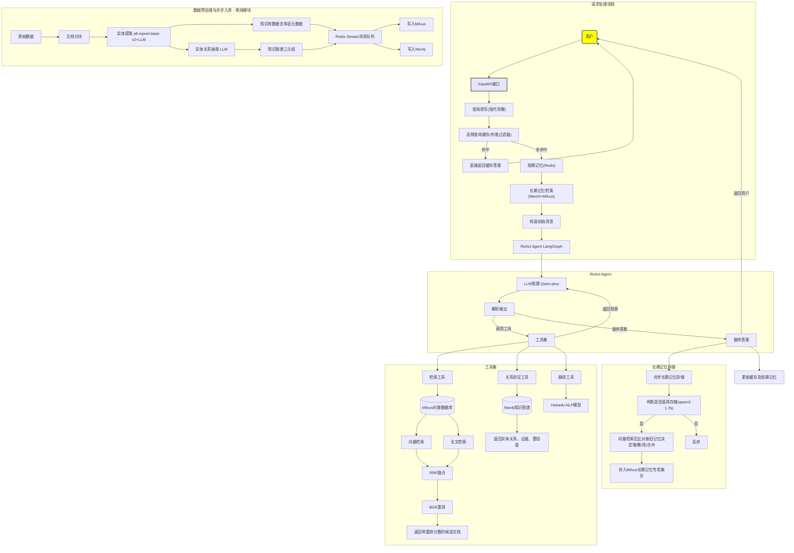

## 📖 项目简介

**Rag** + **ReAct Agent** 开发的**生产级多轮对话系统**，能够根据对话历史与当前问题，**自主规划思考并循环调用多个工具集**，包括混合检索（向量检索+全文检索+重排）、实体关系验证、翻译等工具，最终生成可信答案。通过**多级记忆（短期+长期）+ 查询改写(指代消解)**，系统在多轮对话中保持上下文连贯，并能持久化存储用户画像，实现复杂问题的精准回答。

系统亮点1
- 系统支持**中英双语交互**，支持中文问-英文检-中文回复的完整链路，设计前提是因为知识库为英文数据集，**保证同语言检索精度无损**。
系统亮点2
- Agent开发基于**Langchian1.0版本+LangGraph**，引入**Milvus2.6版本**新索引 IVF_RabitQ 加速向量检索，通过sparse字段 + BM25 Function实现**原生全文检索**，避免引入Elasticsearch增加数据库维护成本。
系统亮点3
- 添加知识图谱对实体关系进行验证，进一步提高答案准确性，支持多跳推理。
  
## 🖼️ 流程图

## ✨ 核心亮点

### 1、多轮对话与指代消解
- **短期记忆**：Redis Hash + Sorted Set 存储最近 5 轮对话，提供会话上下文。
- **长期记忆**：Mem0 + Milvus + Qwen3-1.7b/Qwen3-4b + nomic-embed-text 构成有状态记忆层，实现用户画像动态演进。
    
    - **提取阶段**：Mem0 调用**本地模型 qwen3-1.7b** 判断记忆是否值得存储，通过 prompt 约束返回不超过3条最重要的记忆并携带记忆类型(偏好/事实/事件)和重要性标签。
    - **更新阶段**：Mem0 依次对候选记忆进行向量检索对比新旧记忆，调用**本地模型 qwen3-4b** 判断执行新增/更新/删除或合并操作，经过**嵌入模型 nomic-embed-text** 向量化后入库，保证记忆不冗余不矛盾。
- **查询改写**：**本地模型 Qwen3-4B** 结合短期记忆进行**指代消解**，并将中文问题改写为独立英文检索问题，同时输出中文翻译。

### 2、ReAct Agent 自主规划与工具调用
- **Agent 核心**：Qwen-plus 模型（API）驱动 ReAct 循环，自主决定是思考、观察、行动(调用工具或生成答案)，设置最大循环上限5轮避免无限循环。
    
    - 选型原因：当前用Qwen-plus API替代。后期通过云服务器升级计算资源，本地部署Qwen3-30b-a3b，MOE架构3b激活参数模型专用于ReAct Agent开发，具备自主规划循环调用各工具集能力。
- **工具集**：
  - **检索工具**：双路召回（IVF_RABITQ 向量检索、BM25 全文检索）+ RRF 融合 + BGE-reranker-v2 模型重排，输出 Top-5 候选文档并附带重排评分，确保生成高可信度结果。
  - **实体关系验证工具**：Neo4j 图数据库已存储**知识图谱三元组**，包含实体关系、证据原文及置信度。通过查询两个实体间的直接关系返回结构化证据，增强答案准确性并返回证据原文。
  - **翻译工具**：本地模型 **Helsinki-NLP/opus-mt-en-zh** 英转中模型将英文检索答案翻译为中文，支持中文回复。

### 3、检索系统深度优化
- **向量索引**：Milvus 2.6+ 版本新索引 **IVF_RABITQ** 支撑向量检索 ，相较于HNSW等原主流索引内存占用极低（最高32倍压缩），且查询性能与召回精度皆超越其他索引。
- **全文检索**：Milvus 2.6+ 版本新功能，通过 `sparse` 字段 + BM25 Function 实现**原生全文检索**，无需额外引入Elasticsearch，增加数据库维护成本。
- **长期记忆存储**：Milvus 集合与知识库集合逻辑隔离，每条记忆包含记忆类型与重要性标签，支持时效性衰减混合排序。

### 4、数据预处理与知识图谱增强
- **实体提取**：源数据集送入本地模型 all-mpnet-base-v2 抽取4种基础实体，LLM 抽取 11 种适配数据集的领域实体，最终入库数据包含实体类型元数据标签。
- **实体关系抽取**： LLM抽取实体关系，生成知识图谱三元组，存入图数据库Neo4j，支撑后续 Agent 系统的实体关系验证。
- - **消息队列**：Redis Stream + 消费者队列实现，知识库数据和知识图谱数据多消费者并行写入 Milvus 和 Neo4j，大幅提升吞吐。

### 5、模型量化与推理加速
- **模型量化**：
    - all-mpnet-base-v2：NER提取模型经 ONNXRUNTIME int8量化，模型size**缩小4倍**，推理速度提升 30%，精度损失<1%。
    - Qwen3-4b:Q4_0(Ollama量化版本): 查询改写模型量化后size缩小约两倍，推理速度提升30%。
- **推理加速**
    - 

  ## 🛠️ 技术栈与选型理由

| 组件 | 选型 | 理由 |
|------|------|------|
| **Agent 框架** | LangGraph | 原生状态图编排可精细控制思考-行动-观察循环，实时跟踪工具调用状态与模型决策路径，支持定义循环上限防止无限循环 |
| **ReAct Agent 模型** | Qwen-plus (API) | 大参数模型确保支撑ReAct Agent能精准解析输出、稳定执行工具调用。百炼平台提供百万token Free额度，零成本支撑当前阶段开发与测试，后期用Qwen3-30b-a3b替换 |
| **重排模型** | BGE CrossEncoder (本地) | Hugging Face 成熟专业重排模型|
| **翻译模型** | Helsinki-NLP (本地) | Hugging Face 成熟中英翻译模型 |
| **改写模型** | Qwen3-4B (本地Ollama) | 在Qwen3-1.7b、4B、8b测试中精度与速度平衡最佳 |
| **嵌入模型** | nomic-embed-text (本地Ollama) | 开源轻量嵌入模型的性能标杆，参考MTEB评分及主流选择。统一用于知识库向量化、用户查询向量化及长期记忆向量化，确保语义检索一致性 |
| **长期记忆模型** | qwen3-1.7b/4b (本地Ollama) | 记忆提取本质为轻量级信息筛选，参考Mem0官方基准小size模型为黄金选择。记忆更新使用稍大模型，确保新旧记忆增删改的准确性 |
| **长期记忆框架** | Mem0 | Mem0有内置状态记忆层，自主决策执行 LLM调用、向量检索、新旧记忆的新增/更新/删除/合并，只需prompt引导生成携带记忆类型等元数据的输出。前期使用Langmem开发，过于demo化，代码重构升级为Mem0 |
| **API 服务** | FastAPI | 异步原生，支撑长期记忆异步写入不阻塞agent主程序 |
| **向量数据库** | Milvus 2.6 |IVF_RABITQ向量索引内存占用低且召回率高，sparse+BM25function实现原生全文检索，避免额外引入Elasticsearch降低数据库运维成本，同时通过逻辑分离知识库集合与长期记忆专用集合，保证知识库环境干净 |
| **图数据库** | Neo4j | 知识图谱实体关系存储支持多跳验证，弥补系统多跳问题推理能力不足 |
| **缓存+短期记忆数据库** | Redis-Stack | 内存数据库提供低延迟读写适合短期记忆存取，内置布隆过滤器支撑高频查询缓存过滤 |
| **消息队列** | Redis Stream | 基于现有 Redis 基础设施，轻量级解耦知识库与知识图谱的异步入库，避免引入外部中间件Kafka增加系统复杂度 |
| **模型量化** | ONNXRUNTIME | 相比Optimum方法更底层、可定制化量化范围更广 |
| **日志监控** | LangSmith + 本地logger | 自动提取所有由LangGraph开发的日志减少开发量，本地logger日志兜底 |

## 📁 项目代码结构

📂 config/ -  配置管理

    🐍 config.py - 集成配置管理

    🐍 paths.py -  集成路径管理

    🐍 __init__.py

📂 src/ - 核心源代码

    📂 core/ - 功能模块

        📂 query_rewrite/ - 查询改写

            🐍 query_rewriter.py  # 查询改写功能

            🐍 query_rewrite_test_case.py # 查询改写测试用例脚本

            🐍 __init__.py

        📂 high_frequency_query_cache/ - 高频查询缓存（Redis Bloom Filter）

            🐍 redis_bloom.py  # 高频查询缓存功能

            🐍 redis_bloom_test_case.py  # 高频查询缓存测试用例脚本

            🐍 __init__.py
            
        📂 memory_short/ - 短期记忆（Redis Hash+SortedSet）
        
            🐍 redis_short_memory.py  # 短期记忆提取 + 短期记忆注入功能
            
            🐍 __init__.py

        📂 memory_long/ - 长期记忆（Mem0 + Milvus）
        
            🐍 long_term_memory.py  # 长期记忆提取 + 长期记忆注入功能
    
            🐍 __init__.py

        📂 react_agent/ - ReAct Agent模块
        
            🐍 __init__.py
        
            📂 tools/ - Agent 工具集
                        
                🐍 agent.py - # Agent 图构建与节点
                
                🐍 base.py -  # 工具工厂
                
                🐍 retrieval.py - # 双路检索 + RRF融合 + 重排工具
                
                🐍 relation_verifier.py - # 实体关系验证工具
                
                🐍 translate.py - # 翻译工具

                🐍 __init__.py

        📂 redis-stream/ - 消息队列异步入库
                
            🐍 producer.py -  # 生产者（推送至 Redis Stream）
            
            🐍 milvus_consumer.py - # 消费者：写入 Milvus
            
            🐍 neo4j_consumer.py - # 消费者：写入 Neo4j
    
            🐍 create_milvus_collection.py - # 创建Milvus知识库集合及索引（运行一次）
            
            🐍 long_memory_collection.py - # 创建Milvus长期记忆集合及索引（运行一次）
    
            🐍 megrate_milvus.py - # Milvus知识库迁移（支撑BM25全文检索，运行一次）
    
            🐍 megrate_milvus_test.py - # Milvus迁移测试用例（运行一次）
    
            🐍 __init__.py

🐍 main.py - 核心处理逻辑

🐍 api.py - FastAPI 异步服务入口

🐍 __init__.py

📂 data/ - 原始/处理数据（不提交）

📂 logs/ - 运行时日志（不提交）

📂 models/ - 本地模型文件（不提交）

📂 quantization/ - 量化后模型（不提交）

🔧 .env.example - 环境变量模板（示例，原文件不提交）

🚫 .gitignore - Git 忽略文件

🐳 docker-compose.yml - Docker Compose 编排文件

🏗️ Dockerfile - 应用镜像构建文件

📦 requirements.txt - Python 依赖列表

📖 README.md - 项目说明文档

