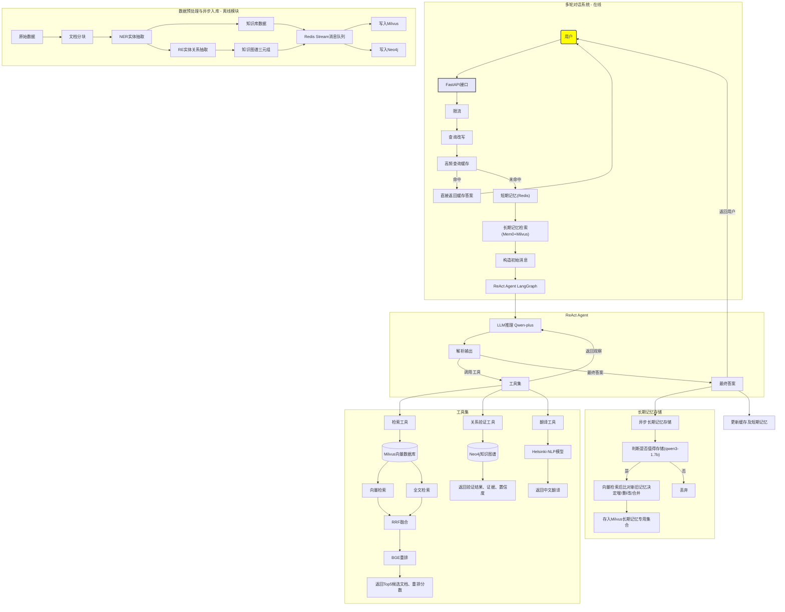

## 📖 项目简介

**ReAct Agent** + **Rag** 开发的**生产级多轮对话系统**，包含以下核心功能：

  - **ReAct自主规划思考**:  通过 `LanGraph状态图编排`规划多个工具集的自主调用，包括`混合检索、实体关系验证、翻译等工具`。

  - **长短期记忆机制**:  通过`多级记忆（短期+长期）+ 查询改写(指代消解)`，在多轮对话中保持上下文连贯、指代准确、持久化存储用户画像。

  - **限流缓存熔断机制**:  通过三级令牌桶防止突发流量缓存穿透，高级查询归一化+布隆过滤器+计数器+互斥锁实现生产级缓存，防止缓存击穿及雪崩。

  - **检索工具集深度优化**：引入 `Milvus2.6版本新索引 IVF_RabitQ 加速向量检索`，`新方法sparse + BM25 Function实现原生全文检索`，避免引入Elasticsearch增加数据库维护成本。

  - **知识图谱增强**：引入 `Neo4j` 存储知识图谱数据，包含`实体关系类型、证据原文及置信度`。对检索结果进行实体关系验证，进一步提升答案准确性，并支持多跳推理扩展。

  
## 🖼️ 流程图

```mermaid
graph TD
    User(用户) --> API[FastAPI接口]
    style User fill:yellow,stroke:#333,stroke-width:2px
    style API fill:#E6E6FA,stroke:#333,stroke-width:2px

    subgraph 多轮对话系统 - 在线
        API --> AH["限流"]
        AH --> QW["查询改写"]
        QW --> Cache["高频查询缓存"]
        Cache -->|命中| DirectReturn[直接返回缓存答案]
        DirectReturn --> User
        Cache -->|未命中| ShortMem["短期记忆(Redis)"]
        ShortMem --> LongMemRet["长期记忆检索(Mem0+Milvus)"]
        LongMemRet --> MsgConstruct[构造初始消息]
        MsgConstruct --> Agent[ReAct Agent LangGraph]
    end

    subgraph ReAct Agent
        Agent --> LLM[LLM推理 Qwen-plus]
        LLM --> Parse[解析输出]
        Parse -->|调用工具| Tools[工具集]
        Tools -->|返回观察| LLM
        Parse -->|最终答案| FinalAns[最终答案]
    end


    subgraph 工具集
        Tools --> Retriever[检索工具]
        Tools --> Verifier[关系验证工具]
        Tools --> Translator[翻译工具]

        Retriever --> Milvus[(Milvus向量数据库)]
        Milvus --> VectorSearch[向量检索]
        Milvus --> FullTextSearch[全文检索]
        VectorSearch --> RRF[RRF融合]
        FullTextSearch --> RRF
        RRF --> Rerank[BGE重排]
        Rerank --> RetResult[返回Top5候选文档、重排分数]
        
        Verifier --> Neo4j[(Neo4j知识图谱)]
        Neo4j --> VeriResult[返回验证结果、证据、置信度]

        Translator --> Helsinki[Helsinki-NLP模型]
        Helsinki --> TranslatorResult[返回中文翻译]

    end

    FinalAns -->|返回用户| User
    FinalAns --> AsyncLongMem[异步长期记忆存储]
    FinalAns --> UpdateCache[更新缓存及短期记忆]

    subgraph 长期记忆存储
        AsyncLongMem --> Decide["判断是否值得存储(qwen3-1.7b)"]
        Decide -->|是| Vectorize[向量检索后比对新旧记忆决定增/删/改/合并]
        Vectorize --> StoreMem[存入Milvus长期记忆专用集合]
        Decide -->|否| Discard[丢弃]
    end

    subgraph 数据预处理与异步入库 - 离线模块
        RawData[原始数据] --> Chunking[文档分块]
        Chunking --> EntityExt[NER实体抽取]
        EntityExt --> KBData[知识库数据]
        KBData --> Stream[Redis Stream消息队列]

        EntityExt --> RelationExt[RE实体关系抽取]
        RelationExt --> KGData[知识图谱三元组]
        KGData --> Stream

        Stream --> MilvusConsumer[写入Milvus]
        Stream --> Neo4jConsumer[写入Neo4j]
    end
```

## ✨ 核心亮点

### 1、多轮对话与指代消解
- **短期记忆**：`Redis Hash` + `Sorted Set` 存储最近 5 轮对话，提供会话上下文。
    - **生产级恢复机制**：`AOF/RDB混合持久化` + `Docker数据卷挂载` + `PostgreSQL全量对话数据存储`，保证系统异常重启后短期记忆不丢失。
- **长期记忆**：`Mem0` + `Milvus` + `Qwen3-1.7b/Qwen3-4b` + `Nomic-embed-text` 构成有状态记忆层，实现用户画像动态演进。
    
    - **提取阶段**：Mem0 调用本地模型 `Qwen3-1.7b` 判断记忆是否值得存储，通过 `Prompt` 约束返回最多3条最重要的记忆并携带记忆类型(偏好/事实/事件)和重要性（0-1）标签。
    - **更新阶段**：Mem0 依次对候选记忆进行向量检索对比新旧记忆，传递给本地模型 `Qwen3-4b` 执行新增/更新/删除或合并操作，经过嵌入模型 `Nomic-embed-text` 向量化后入库，保证记忆不冗余不矛盾。
- **查询改写**：本地模型 `Qwen3-4B` 结合短期记忆 + `few-shot prompt` 进行**指代消解**，并将中文问题改写为独立英文检索问题，同时输出中文翻译。

### 2、ReAct Agent 自主规划与工具调用
- **Agent 核心**：`Qwen-plus` 模型（API）作为 ReAct Agent中驱，自主决定是思考、观察、行动(调用工具或生成答案)。
    
    - 选型原因：当前用 `Qwen-plus API` 替代。后期通过云服务器升级计算资源，本地部署 `Qwen3-30b-a3b` ，MOE架构3b激活参数模型专用于ReAct Agent开发，具备自主规划循环调用各工具集能力。

- **Agent 框架：LanGraph**
  - 基于有向图将 `ReAct` 循环显式拆解为 `思考-行动-观察` 节点，通过条件边动态控制分支。集成 `CoT` 思维链，强制 LLM 在每次决策前输出推理步骤Thought，实现 `先思考后行动` 的显式规划。

- **工具集**：
  - **检索工具**：`双路召回（ 向量检索 / BM25全文检索）+ RRF 融合 + BGE-reranker-v2 模型重排`，输出 Top-5 候选文档并附带重排评分，确保生成高可信度结果。
  - **实体关系验证工具**：Neo4j 图数据库已存储 `知识图谱三元组`，包含`实体关系、证据原文及置信度`。通过查询两个实体间的直接关系返回结构化证据，增强答案准确性并返回证据原文。
  - **翻译工具**：本地模型 `Helsinki-NLP/opus-mt-en-zh` 英转中模型将英文检索答案翻译为中文，支撑中文回复。

### 3、检索系统深度优化
- **向量索引**：`Milvus 2.6`+ 版本新索引 `IVF_RABITQ` 支撑向量检索 ，相较于`HNSW`等原主流索引内存占用极低（最高32倍压缩），且查询性能与召回精度皆超越其他索引。
- **全文检索**：`Milvus 2.6`+ 版本新功能，通过 `sparse` 字段 + `BM25 Function` 实现**原生全文检索**，无需额外引入Elasticsearch，增加数据库维护成本。
- **长期记忆存储**：Milvus 集合与知识库集合逻辑隔离，每条长期记忆包含`记忆类型与重要性标签`，支持时效性衰减混合排序。

### 4、数据预处理与知识图谱增强
- **实体提取**：源数据集送入本地模型 `en-core-web-trf` 抽取4种基础实体，LLM 抽取 11 种适配数据集的领域实体，入库的知识库数据包含实体类型元数据标签。
- **实体关系抽取**： LLM抽取实体关系，生成知识图谱三元组，存入图数据库Neo4j，支撑后续 Agent 系统的实体关系验证。
- **消息队列**：`Redis Stream + 消费者队列`实现，知识库数据和知识图谱数据多消费者并行写入 Milvus 和 Neo4j，大幅提升吞吐。

### 5、本地模型量化与微调
- **模型量化**：

  **GPU 推理**（vLLM，OpenAI 兼容接口）

  | 模型 | 部署方式 | 量化方式 | 显存占用 | 说明 |
  |------|---------|---------|---------|------|
  | Qwen3-4B | vLLM 端口 8001 | AWQ int4官方量化版本 | ~8GB | 查询改写 / 记忆合并 / 反思生成 |
  | Qwen3-1.7B | vLLM 端口 8002 | AWQ int4官方量化版本 | ~4GB | 长期记忆提取 |

  **CPU 推理**（ONNX Runtime，三个轻量模型）

  | 模型 | 量化方式 | 原始大小 | 量化后大小 | 压缩比 | 单次延迟 (p50) | 内存占用 |
  |------|---------|---------|-----------|--------|---------------|---------|
  | BGE-Reranker-v2-M3 | ONNX 导出 + INT8 动态量化 | ~1.1 GB | 543 MB | ↓50% | 38.8 ms | ~1.2 GB |
  | nomic-embed-text-v1 | ONNX导出 + INT8动态量化 | 523 MB | 132 MB | ↓75% | 13.9 ms | ~285 MB |
  | Helsinki-NLP/opus-mt-en-zh | ONNX 导出 + INT8 动态量化（encoder + decoder 分别量化） | 552 MB | 139 MB | ↓75% | 66.7 ms | ~256 MB |

- **部署**
    - 容器化：使用 `Docker Compose` 编排所有服务（Redis、Milvus、Neo4j、Ollama），实现一键启动完整环境，保证环境一致性。
    - API 服务：`FastAPI` 提供高并发异步接口，将长期记忆模块异步化不阻塞 Agent 主程序。

## 📚 知识库选型：Wizard of Wikipedia (英文数据集)
  本系统采用 Facebook AI 发布的 Wizard of Wikipedia (WoW) 数据集作为核心知识库。包含 22k+ 多轮对话（训练集 18k、验证集 2k、测试集 2k），共覆盖 1.3k+个维基百科主题。

**选型理由**：
  - 跨领域覆盖：主题涵盖历史、科技、艺术、娱乐等领域，考验系统在不同类型主题查询下的检索与生成能力。
  - RAG 基准：作为学术界和工业界广泛使用的 RAG 评估黄金基准。
  - 高轮次：单条数据平均`9.15轮`对话，考验系统在多轮对话中的短期记忆连贯性与指代消解能力。
  - 知识密集：单条数据平均 `750-1000 tokens` 的适中长度，考验模型的长上下文处理能力。

**预处理后数据集特征**：
  - 分块后平均轮次：`3.0轮`
  - 分块后平均大小：`724字符`
  - 分块后目标范围（800-1800字符）：`25.5%`数据落于目标范围内，`74.5%`数据小于目标范围（源数据本身包含大量短文本），无数据超过目标范围。
  - 每100条数据关系密度：经`NER抽取`和`RE抽取`后，`每100条数据总实体数量1917`，`总关系数345`，`18%关系密度`合理。

  ## 🛠️ 技术栈与选型理由

| 组件 | 选型 | 理由 |
|------|------|------|
| **Agent 框架** | LangGraph | 原生状态图编排可精细控制思考-行动-观察循环，结合Cot使LLM展示思考过程，大幅提高生成准确率 |
| **ReAct Agent 模型** | Qwen-plus (API) | 大参数模型确保支撑ReAct Agent能精准解析输出、稳定执行工具调用。百炼平台提供百万token Free额度，零成本支撑当前阶段开发与测试，后期用Qwen3-30b-a3b替换 |
| **重排模型** | BGE CrossEncoder (本地) | Hugging Face 成熟专业重排模型|
| **翻译模型** | Helsinki-NLP (本地) | Hugging Face 成熟中英翻译模型 |
| **改写模型** | Qwen3-4B (本地Ollama) | 参考指代消解主流模型选型经验(4-8B)，分别在Qwen3-1.7b、4B、8b测试，4B为精度与速度平衡最佳 |
| **嵌入模型** | nomic-embed-text-v1 (本地) | 知识库入库数据为英文数据集，参考MTEB榜单评分，nomic为英文场景开源轻量嵌入模型的性能标杆。需统一用于知识库向量化入库、用户查询向量化、长期记忆向量化，确保模型维度对齐 |
| **长期记忆模型** | qwen3-1.7b/4b (本地Ollama) | 参考Mem0官方文档，记忆提取部分 Small size模型为黄金选择，记忆更新部分使用稍大模型，确保新旧记忆增删改的准确性 |
| **长期记忆框架** | Mem0 | 内置状态记忆层，自主决策执行 LLM调用、向量检索、新旧记忆的新增/更新/删除/合并，只需 prompt 引导生成携带记忆类型等元数据的输出。前期使用LangMem开发，过于demo化，代码重构升级为Mem0 |
| **API 服务** | FastAPI | 异步原生，支撑长期记忆异步写入不阻塞agent主程序 |
| **向量数据库** | Milvus 2.6 |IVF_RABITQ 新索引内存占用低且召回率高，sparse + BM25function实现原生全文检索，避免额外引入Elasticsearch降低数据库运维成本 |
| **图数据库** | Neo4j | GraphRag主流选择，支撑知识图谱存储 |
| **缓存+短期记忆数据库** | Redis-Stack | 内存数据库，低延迟读写适合短期记忆存取，内置布隆过滤器支撑高频查询缓存过滤 |
| **消息队列** | Redis Stream | 基于现有 Redis 基础设施，轻量级解耦知识库与知识图谱的异步入库，避免引入外部中间件Kafka增加系统复杂度 |
| **模型量化** | ONNXRUNTIME | 相比Optimum方法更底层、可定制化量化范围更广 |
| **日志监控** | LangSmith + 本地logger | 自动生成所有由LangGraph开发的结构化日志 + 本地logger日志兜底 |

## 📸 演示截图

| FastAPI 单轮对话请求与响应示例 | FastAPI 多轮对话成功指代消解示例 |  |
|-------------|---------|-------------|
|  |  |
  
| 完整请求日志1 | 完整请求日志2  | 完整请求日志3  | 完整请求日志4  | 
|---------------|---------------|---------------|---------------|
|  |  |  |  |

## 🚀 后续优化方向
  - **推理引擎升级**：
      - 将 Qwen-plus api 替换为 Qwen3-30B-A3B本地模型推理，移除 API 费用。
      - 将`重排模型、翻译模型`从 `GPU` 迁移至 `CPU（ONNX Runtime 加速）`，释放 GPU 显存用于核心 LLM 推理，利用 CPU 多核并行满足重排与翻译的低延迟需求，支撑稳定并发。
      - 预期在`单卡A10支撑8-12稳定并发`，`首Token延迟降低30%`，`吞吐提升3-5倍`。
      - 添加多 Agent 协作，改造原有LangGraph单Agent模式。
      - 添加 MCP在线搜索服务嵌入。
      - 添加K3S部署，替代原有Docker Compose。
 
  - **实体关系验证增强**：
      - 知识图谱三元组数据添加`有向关系`，为`多跳路径`提供明确方向。当前知识图谱仅包含`关系类型、置信度和证据原文`。
      - 添加`实体类型标签（知识库已有字段）`：多跳查询中按类型过滤是必要前提，否则路径会混杂无关节点。
      - 扩展实体关系验证工具，支持 `Cypher 多跳查询（[*1..3]）`，实现复杂路径推理，提升系统多跳推理能力。

## 📁 项目代码结构
    ├── config/ - 配置文件
      ├── congig_paths.py  # 集成配置管理
      ├── paths.py  # 集成路径管理  

    ├── src/ - 核心源代码
      ├── main.py  # 核心处理逻辑
      ├── api.py  # FastAPI 异步服务入口
      ├── core/     
        ├── query_rewrite/ - 查询改写
           ├── query_rewriter.py  # # 查询改写功能
           ├── query_rewriter_test_case.py  # 模块测试用例
           
        ├── high_frequency_query_cache/ - 高频查询缓存（Redis Bloom Filter）
           ├── redis_bloom.py  # 高频查询缓存功能
           ├── redis_bloom_test_case.py  # 模块测试用例
  
        ├── memory_short/ - 短期记忆（Redis Hash+SortedSet）
           ├── redis_short_memory.py  # 短期记忆提取 + 短期记忆注入功能
  
        ├── memory_long/ - 长期记忆（Mem0 + Milvus）
           |—— long_term_memory.py  # 长期记忆提取 + 长期记忆注入功能
           
        |—— reAct agent/  - Agent开发
            |—— tools/ 工具集
              |—— agent.py - # Agent 图构建与节点
              |—— base.py -  # 工具工厂
              |—— retrieval.py - # 混合检索重排工具
              |—— relation_verifier.py - # 实体关系验证工具
              |—— translate.py - # 翻译工具
              
        |—— redis-stream/ - 消息队列异步入库
              |—— producer.py -  # 生产者（推送至 Redis Stream）
              |—— milvus_consumer.py - # 消费者：写入 Milvus
              |—— neo4j_consumer.py - # 消费者：写入 Neo4j
              |—— create_milvus_collection.py - # 创建Milvus知识库集合及索引（运行一次）
              |—— long_memory_collection.py - # 创建Milvus长期记忆集合及索引（运行一次）
              |—— megrate_milvus.py - # Milvus知识库迁移（支撑BM25全文检索，运行一次）
              |—— megrate_milvus_test.py - # Milvus迁移测试用例（运行一次） 
            
      |—— chunking/ - 数据预处理模块
      ├── models/ - 本地模型
      ├── quantization/ - 量化后模型
      ├── data/ - 源数据
      ├── .env.example - 环境变量模板（示例，原文件不提交）
      ├── .gitignore - Git 忽略文件
      ├── docker-compose.yml - Docker Compose 编排文件
      ├── Dockerfile - 应用镜像构建文件
      ├── requirements.txt - Python 依赖列表
      ├── README.md - 项目说明文档
